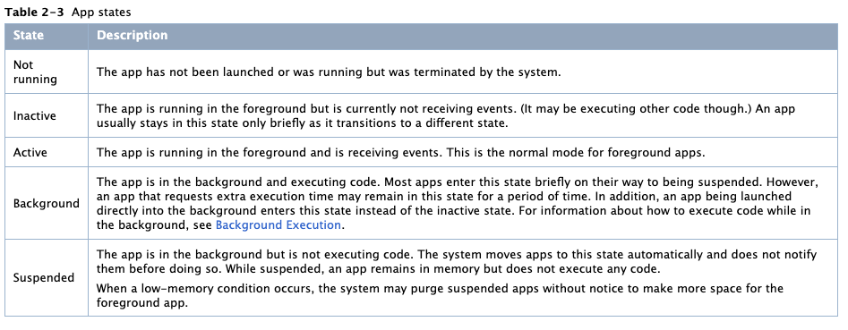

# Reading Data from HealthKit & The App Life Cycle

## The App Life Cycle

Reference: [The App Life Cycle](https://developer.apple.com/library/archive/documentation/iPhone/Conceptual/iPhoneOSProgrammingGuide/TheAppLifeCycle/TheAppLifeCycle.html)

### Execution States for Apps

At any given moment, your app is in one of the states listed in this table:

The system moves your app from state to state in response to actions happening throughout the system.

> **My note:**
> 
> - Inactive: 
> 	- In the **foreground**, but **not receiving events**. (It may be executing other code though.) 
> 	- An app usually stays in this state only **briefly** as it transitions to a different state.
> - Background: 
> 	- In the **background** and **executing code**. 
> 	- Most apps enter this state **briefly** on their way to being suspended. 
> 	- However, an app that **requests extra execution tim**e may remain in this state for a period of time. (~ 3 mins)
> 	- In addition, an app being launched directly into the background enters this state instead of the inactive state.
> - Suspended:
> 	- In the **background** but is **not executing code**. 
> 	- The system moves apps to this state **automatically** and **does not notify** them before doing so. 
> 	- While suspended, an **app remains in memory but does not execute any code**.
>	- When a low-memory condition occurs, the system may purge suspended apps without notice to make more space for the foreground app.

Delegating method:

- `application:willFinishLaunchingWithOptions:`
- `application:didFinishLaunchingWithOptions:`
- `applicationDidBecomeActive:`
- `applicationWillResignActive:`
- `applicationDidEnterBackground:`
- `applicationWillEnterForeground:`
- `applicationWillTerminate:` **This method is not called if your app is suspended.**

### App Termination

Apps must be prepared for termination to happen at any time and **should not wait** to save user data or perform other critical tasks.

Termination:

- **System-initiated termination** is a normal part of an app’s life cycle.
- **User-initiated termination**

**Suspended apps** receive no notification when they are terminated by system / user.

